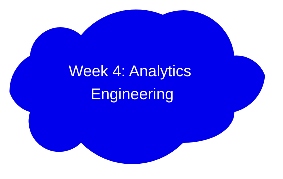

# DataEngineerZoomCamp2024Week4
Analytics Engineering using dbt &amp; BigQuery

[Slides](https://docs.google.com/presentation/d/1xSll_jv0T8JF4rYZvLHfkJXYqUjPtThA/edit#slide=id.p1)

## Lesson Learned

### 1. What is Analytics Engineering

### 2. Data Modelling Concepts

### 3. What is dbt

### 4. Starting a dbt project

### 5. Develop dbt models

### 6. Testing and documenting dbt models

### 7. Deploy a dbt project

### 8. Visualization of the transformed data
