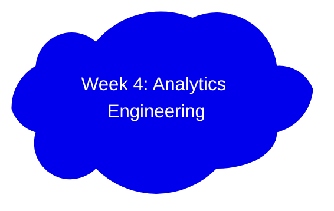

# DataEngineerZoomCamp2024Week4
Analytics Engineering using dbt &amp; BigQuery

[Slides](https://docs.google.com/presentation/d/1xSll_jv0T8JF4rYZvLHfkJXYqUjPtThA/edit#slide=id.p1)

## Lesson Learned

### 1. What is Analytics Engineering
- Data Engineer
  - Prepares and maintain the infrastructure the data team needs

- Data Analyst
  - Uses data to answer questions and solve business problems

- Analytics Engineer
  - Bridge the gap between Data Engineer and Data Analyst
  - Bring in good software engineering practices to the efforts of data analysts and data scientists
 
- Tools
  - Data Ingestion
    - Fivetran
    - Mage
  - Data Storage
    - Snowflake
    - Bigquery
    - Redshift
  - Data Modelling
    - dbt
    - Dataform
  - Data Visualization
    - Looker
    - Mode
    - Tableau

### 2. Data Modelling Concepts
- ETL vs ELT
  - ETL
    - Slightly more stable and compliant data analysis
    - Higher storage and compute costs
  - ELT
    - Faster and more flexible data analysis
    - Lower cost and lower maintenance
   
- Kimball's Dimensional Modelling
  - Deliver data understandable to business users
  - Deliver fast query performance
  - Fact tables (verbs)
  - Dimension tables (nouns)
  - Stages (think of a restaurant)
    - Stage Area/ Bronze (Raw data)
    - Processing Area/ Silver (raw data to data models)
    - Presentation Area/ Gold (Present data to users)

- Other modelling approaches
  - Inmon
  - Data Vault

### 3. What is dbt

### 4. Starting a dbt project

### 5. Develop dbt models

### 6. Testing and documenting dbt models

### 7. Deploy a dbt project

### 8. Visualization of the transformed data
